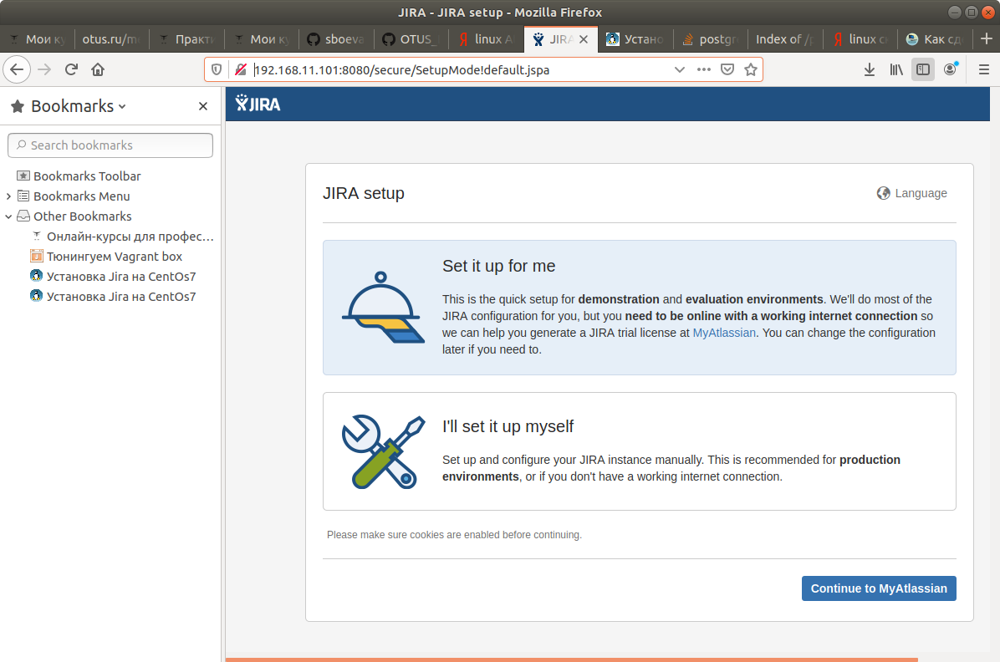

# Создание сервиса мониторинга лога

1. Создаем файл кофигурации watchlog, в котором зададим переменным название файла для мониторинга и слово,которое будет искать сервис  
		[root@localhost vagrant]# > /etc/sysconfig/watchlog  
		[root@localhost vagrant]# vi /etc/sysconfig/watchlog  
		[root@localhost vagrant]# cat /etc/sysconfig/watchlog  
	```
	# File and word that we will be monit
	WORD="ALERT"
	LOG=/var/log/watchlog.log
	```

2. Создаем тестовый файл логов /var/log/watchlog.log и наполняем его данными, добавляем отлавливаемое слово ‘ALERT’  
		[root@localhost vagrant]# > /var/log/watchlog.log  
		[root@localhost vagrant]# vi /var/log/watchlog.log  
		[root@localhost vagrant]# cat /var/log/watchlog.log  
	```
	log1
	log2
	log3
	Alert
	log4
	...
	```

3. Создаем файл скрипта /opt/watchlog.sh, который будет искать заданное слово  
		[root@localhost vagrant]# > /opt/watchlog.sh  
		[root@localhost vagrant]# vi /opt/watchlog.sh  
		[root@localhost vagrant]# cat /opt/watchlog.sh  
	```
	#!/bin/bash

	WORD=$1
	LOG=$2
	DATE=`date`

	if grep -i $WORD $LOG &> /dev/null
	then
	  logger "$DATE: I found the word $WORD in the log $LOG, Master!"
	fi
	exit 0
	```

4. Делаем скрипт исполняемым  
		[root@localhost vagrant]# chmod +x /opt/watchlog.sh  

5. Создадим юнит /etc/systemd/system/watchlog.service для сервиса watchlog  
		[root@localhost vagrant]# > /etc/systemd/system/watchlog.service  
		[root@localhost vagrant]# vi /etc/systemd/system/watchlog.service  
		[root@localhost vagrant]# cat /etc/systemd/system/watchlog.service  
	```
	[Unit]
	Description=My watchlog service

	[Service]
	Type=oneshot
	EnvironmentFile=/etc/sysconfig/watchlog
	ExecStart=/opt/watchlog.sh $WORD $LOG
	```
6. Создадим юнит /etc/systemd/system/watchlog.timer для таймера watchlog  
		[root@localhost vagrant]# > /etc/systemd/system/watchlog.timer  
		[root@localhost vagrant]# vi /etc/systemd/system/watchlog.timer  
		[root@localhost vagrant]# cat /etc/systemd/system/watchlog.timer  

	```
	[Unit]
	Description=Runs watchlog script every 5 seconds

	[Timer]
	AccuracySec=1us
	# Run after booting 5 seconds
	OnBootSec=5
	# Run every 5 seconds
	OnUnitActiveSec=5
	Unit=watchlog.service

	[Install]
	WantedBy=multi-user.target
	```
7. Далее делаем релоад systemd  
		[root@localhost vagrant]# systemctl daemon-reload  

8. Добавляем созданный сервис watchlog.service в автозагрузку  
		[root@localhost vagrant]# systemctl enable watchlog.service  

9. Запустим сервис watchlog  
		[root@localhost vagrant]# systemctl start watchlog  

10. Убедимся в периодическом запуске сервиса и поиске слова в логе  
		[root@localhost vagrant]# tail -f -n 10 /var/log/messages  
	```
	Dec 16 10:13:36 localhost systemd: Started My watchlog service.
	Dec 16 10:13:41 localhost systemd: Starting My watchlog service...
	Dec 16 10:13:41 localhost root: Mon Dec 16 10:13:41 UTC 2019: I found the word ALERT in the log /var/log/watchlog.log, Master!
	Dec 16 10:13:41 localhost systemd: Started My watchlog service.
	Dec 16 10:13:46 localhost systemd: Starting My watchlog service...
	Dec 16 10:13:46 localhost root: Mon Dec 16 10:13:46 UTC 2019: I found the word ALERT in the log /var/log/watchlog.log, Master!
	Dec 16 10:13:46 localhost systemd: Started My watchlog service.
	Dec 16 10:13:51 localhost systemd: Starting My watchlog service...
	Dec 16 10:13:51 localhost root: Mon Dec 16 10:13:51 UTC 2019: I found the word ALERT in the log /var/log/watchlog.log, Master!
	Dec 16 10:13:51 localhost systemd: Started My watchlog service.
	Dec 16 10:13:56 localhost systemd: Starting My watchlog service...
	Dec 16 10:13:56 localhost root: Mon Dec 16 10:13:56 UTC 2019: I found the word ALERT in the log /var/log/watchlog.log, Master!
	Dec 16 10:13:56 localhost systemd: Started My watchlog service.
	Dec 16 10:14:01 localhost systemd: Starting My watchlog service...
	Dec 16 10:14:01 localhost root: Mon Dec 16 10:14:01 UTC 2019: I found the word ALERT in the log /var/log/watchlog.log, Master!
	Dec 16 10:14:01 localhost systemd: Started My watchlog service.
	```

# Изменение init-скрипта Spawn-fcgi на unit-файл

1. Устанавливаем spawn-fcgi и необходимые для него пакеты  
		[root@localhost vagrant]# yum install epel-release -y && yum install spawn-fcgi php php-cli mod_fcgid httpd -y  
	```
	...
	Installed:
	  epel-release.noarch 0:7-11                                                   

	Complete!
	...
	Installed:
	  httpd.x86_64 0:2.4.6-90.el7.centos     mod_fcgid.x86_64 0:2.3.9-6.el7        
	  php.x86_64 0:5.4.16-46.1.el7_7         php-cli.x86_64 0:5.4.16-46.1.el7_7    
	  spawn-fcgi.x86_64 0:1.6.3-5.el7       

	Dependency Installed:
	  apr.x86_64 0:1.4.8-5.el7                                                     
	  apr-util.x86_64 0:1.5.2-6.el7                                                
	  httpd-tools.x86_64 0:2.4.6-90.el7.centos                                     
	  libzip.x86_64 0:0.10.1-8.el7                                                 
	  mailcap.noarch 0:2.1.41-2.el7                                                
	  php-common.x86_64 0:5.4.16-46.1.el7_7                                        

	Complete!
	```
2. Исправим переменные в конфигурационном файле /etc/sysconfig/spawn-fcgi  
		[root@localhost vagrant]# vi /etc/sysconfig/spawn-fcgi  
		[root@localhost vagrant]# cat /etc/sysconfig/spawn-fcgi  
	```
	# You must set some working options before the "spawn-fcgi" service will work.
	# If SOCKET points to a file, then this file is cleaned up by the init script.
	#
	# See spawn-fcgi(1) for all possible options.
	#
	# Example :
	SOCKET=/var/run/php-fcgi.sock
	OPTIONS="-u apache -g apache -s $SOCKET -S -M 0600 -C 32 -F 1 -- /usr/bin/php-cgi"
	#OPTIONS="-u apache -g apache -s $SOCKET -S -M 0600 -C 32 -F 1 -P /var/run/spawn-fcgi.pid -- /usr/bin/php-cgi"
	```
3. Создадим unt-файл /etc/systemd/system/spawn-fcgi.service  
		[root@localhost bin]# > /etc/systemd/system/spawn-fcgi.service  
		[root@localhost bin]# vi /etc/systemd/system/spawn-fcgi.service  
		[root@localhost bin]# cat /etc/systemd/system/spawn-fcgi.service  
	```
	[Unit]
	Description=Spawn-fcgi startup service by Otus
	After=network.target

	[Service]
	Type=simple
	PIDFile=/var/run/spawn-fcgi.pid
	EnvironmentFile=/etc/sysconfig/spawn-fcgi
	ExecStart=/usr/bin/spawn-fcgi -n $OPTIONS
	KillMode=process

	[Install]
	WantedBy=multi-user.target
	```
4. Запускаем и убеждаемся что все успешно работает   
		[root@localhost bin]# systemctl start spawn-fcgi  
		[root@localhost bin]# systemctl status spawn-fcgi  
	```
	● spawn-fcgi.service - Spawn-fcgi startup service by Otus
	   Loaded: loaded (/etc/systemd/system/spawn-fcgi.service; disabled; vendor preset: disabled)
	   Active: active (running) since Пн 2019-12-16 10:47:38 UTC; 3s ago
	 Main PID: 4729 (php-cgi)
	   CGroup: /system.slice/spawn-fcgi.service
		   ├─4729 /usr/bin/php-cgi
		   ├─4730 /usr/bin/php-cgi
		   ├─4731 /usr/bin/php-cgi
		   ├─4732 /usr/bin/php-cgi
		   ├─4733 /usr/bin/php-cgi
		   ├─4734 /usr/bin/php-cgi
		   ├─4735 /usr/bin/php-cgi
		   ├─4736 /usr/bin/php-cgi
		   ├─4737 /usr/bin/php-cgi
		   ├─4738 /usr/bin/php-cgi
		   ├─4739 /usr/bin/php-cgi
		   ├─4740 /usr/bin/php-cgi
		   ├─4741 /usr/bin/php-cgi
		   ├─4742 /usr/bin/php-cgi
		   ├─4743 /usr/bin/php-cgi
		   ├─4744 /usr/bin/php-cgi
		   ├─4745 /usr/bin/php-cgi
		   ├─4746 /usr/bin/php-cgi
		   ├─4747 /usr/bin/php-cgi
		   ├─4748 /usr/bin/php-cgi
		   ├─4749 /usr/bin/php-cgi
		   ├─4750 /usr/bin/php-cgi
		   ├─4751 /usr/bin/php-cgi
		   ├─4752 /usr/bin/php-cgi
		   ├─4753 /usr/bin/php-cgi
		   ├─4754 /usr/bin/php-cgi
		   ├─4755 /usr/bin/php-cgi
		   ├─4756 /usr/bin/php-cgi
		   ├─4757 /usr/bin/php-cgi
		   ├─4758 /usr/bin/php-cgi
		   ├─4759 /usr/bin/php-cgi
		   ├─4760 /usr/bin/php-cgi
		   └─4761 /usr/bin/php-cgi

	дек 16 10:47:38 localhost.localdomain systemd[1]: Started Spawn-fcgi star...
	Hint: Some lines were ellipsized, use -l to show in full.
	```

# Реализуем возможность запуска нескольких инстансов сервера с разными конфигами 
http://automation-remarks.com/setting-vagrant/
https://github.com/kyourselfer/OTUS_LinuxAdmin201804/tree/master/lesson6_SystemD/SCRIPTS/apache_multipleConf


1. Копируем юнит-файл /usr/lib/systemd/system/httpd.service в каталог /etc/systemd/system/ c изменением имени на httpd@.service  
		[root@localhost vagrant]# cp /usr/lib/systemd/system/httpd.service /etc/systemd/system/httpd@.service  

2. Изменяем в юнит-файле значение параметра EnvironmentFile с /etc/sysconfig/httpd на /etc/sysconfig/httpd-%I  
		[root@localhost vagrant]# vi /etc/systemd/system/httpd@.service  
		[root@localhost vagrant]# cat /etc/systemd/system/httpd@.service  
	```
	[Unit]
	Description=The Apache HTTP Server
	After=network.target remote-fs.target nss-lookup.target
	Documentation=man:httpd(8)
	Documentation=man:apachectl(8)

	[Service]
	Type=notify
	EnvironmentFile=/etc/sysconfig/httpd-%I
	ExecStart=/usr/sbin/httpd $OPTIONS -DFOREGROUND
	ExecReload=/usr/sbin/httpd $OPTIONS -k graceful
	ExecStop=/bin/kill -WINCH ${MAINPID}
	# We want systemd to give httpd some time to finish gracefully, but still want
	# it to kill httpd after TimeoutStopSec if something went wrong during the
	# graceful stop. Normally, Systemd sends SIGTERM signal right after the
	# ExecStop, which would kill httpd. We are sending useless SIGCONT here to give
	# httpd time to finish.
	KillSignal=SIGCONT
	PrivateTmp=true

	[Install]
	WantedBy=multi-user.target
	```
3. Создаем первый файл окружения /etc/sysconfig/httpd-first, в котором указываем первый файл конфигурации сервера  
		[root@localhost vagrant]# > /etc/sysconfig/httpd-first  
		[root@localhost vagrant]# vi /etc/sysconfig/httpd-first  
		[root@localhost vagrant]# cat /etc/sysconfig/httpd-first  
	```
	# /etc/sysconfig/httpd-first
	OPTIONS=-f conf/first.conf
	```
4. Создаем второй файл окружения /etc/sysconfig/httpd-second, в котором указываем второй файл конфигурации сервера  
		[root@localhost vagrant]# > /etc/sysconfig/httpd-second  
		[root@localhost vagrant]# vi /etc/sysconfig/httpd-second  
		[root@localhost vagrant]# cat /etc/sysconfig/httpd-second  
	```
	# /etc/sysconfig/httpd-second
	OPTIONS=-f conf/second.conf
	```
5. Создадим две новых копии текущего конфигурационного файла httpd.conf - first.conf и second.conf и проверим их наличие  
		[root@localhost vagrant]# cp /etc/httpd/conf/httpd.conf /etc/httpd/conf/first.conf  
		[root@localhost vagrant]# cp /etc/httpd/conf/httpd.conf /etc/httpd/conf/second.conf  
		[root@localhost vagrant]# ls /etc/httpd/conf/  
	```
	first.conf  httpd.conf  magic  second.conf
	```

6. Исправим второй конфигурационный файл. Поменяем значения PidFile и Listen  
		[root@localhost vagrant]# vi /etc/httpd/conf/second.conf  
		[root@localhost vagrant]# cat /etc/httpd/conf/second.conf  
	```
	...
	#
	# ServerRoot: The top of the directory tree under which the server's
	# configuration, error, and log files are kept.
	#
	# Do not add a slash at the end of the directory path.  If you point
	# ServerRoot at a non-local disk, be sure to specify a local disk on the
	# Mutex directive, if file-based mutexes are used.  If you wish to share the
	# same ServerRoot for multiple httpd daemons, you will need to change at
	# least PidFile.
	#
	ServerRoot "/etc/httpd"
	PidFile /var/run/httpd-second.pid

	#
	# Listen: Allows you to bind Apache to specific IP addresses and/or
	# ports, instead of the default. See also the <VirtualHost>
	# directive.
	#
	# Change this to Listen on specific IP addresses as shown below to 
	# prevent Apache from glomming onto all bound IP addresses.
	#
	#Listen 12.34.56.78:80
	Listen 8080
	...
	```
7. Делаем релоад systemd  
		[root@localhost vagrant]# systemctl daemon-reload  

8. Запустим два инстанса  
		systemctl start httpd@first  
		systemctl start httpd@second  

9. Проверим запуск первого экземпляра  
		[root@localhost vagrant]# systemctl status httpd@first  
	```
	● httpd@first.service - The Apache HTTP Server
	   Loaded: loaded (/etc/systemd/system/httpd@.service; disabled; vendor preset: disabled)
	   Active: active (running) since Пн 2019-12-16 18:46:28 UTC; 35s ago
	     Docs: man:httpd(8)
		   man:apachectl(8)
	 Main PID: 4176 (httpd)
	   Status: "Total requests: 0; Current requests/sec: 0; Current traffic:   0 B/sec"
	   CGroup: /system.slice/system-httpd.slice/httpd@first.service
		   ├─4176 /usr/sbin/httpd -f conf/first.conf -DFOREGROUND
		   ├─4177 /usr/sbin/httpd -f conf/first.conf -DFOREGROUND
		   ├─4178 /usr/sbin/httpd -f conf/first.conf -DFOREGROUND
		   ├─4179 /usr/sbin/httpd -f conf/first.conf -DFOREGROUND
		   ├─4180 /usr/sbin/httpd -f conf/first.conf -DFOREGROUND
		   ├─4181 /usr/sbin/httpd -f conf/first.conf -DFOREGROUND
		   └─4182 /usr/sbin/httpd -f conf/first.conf -DFOREGROUND

	дек 16 18:46:28 localhost.localdomain systemd[1]: Starting The Apache HTTP...
	дек 16 18:46:28 localhost.localdomain httpd[4176]: AH00558: httpd: Could n...
	дек 16 18:46:28 localhost.localdomain systemd[1]: Started The Apache HTTP ...
	Hint: Some lines were ellipsized, use -l to show in full.
	```
10. Проверим запуск второго экземпляра  
		[root@localhost vagrant]# systemctl status httpd@second  
	```
	● httpd@second.service - The Apache HTTP Server
	   Loaded: loaded (/etc/systemd/system/httpd@.service; disabled; vendor preset: disabled)
	   Active: active (running) since Пн 2019-12-16 18:47:53 UTC; 12s ago
	     Docs: man:httpd(8)
		   man:apachectl(8)
	 Main PID: 4216 (httpd)
	   Status: "Total requests: 0; Current requests/sec: 0; Current traffic:   0 B/sec"
	   CGroup: /system.slice/system-httpd.slice/httpd@second.service
		   ├─4216 /usr/sbin/httpd -f conf/second.conf -DFOREGROUND
		   ├─4217 /usr/sbin/httpd -f conf/second.conf -DFOREGROUND
		   ├─4218 /usr/sbin/httpd -f conf/second.conf -DFOREGROUND
		   ├─4219 /usr/sbin/httpd -f conf/second.conf -DFOREGROUND
		   ├─4220 /usr/sbin/httpd -f conf/second.conf -DFOREGROUND
		   ├─4221 /usr/sbin/httpd -f conf/second.conf -DFOREGROUND
		   └─4222 /usr/sbin/httpd -f conf/second.conf -DFOREGROUND

	дек 16 18:47:53 localhost.localdomain systemd[1]: Starting The Apache HTTP...
	дек 16 18:47:53 localhost.localdomain httpd[4216]: AH00558: httpd: Could n...
	дек 16 18:47:53 localhost.localdomain systemd[1]: Started The Apache HTTP ...
	Hint: Some lines were ellipsized, use -l to show in full.
	```
11. Проверим прослушиваемые порты  
		ss -tnulp | grep httpd  
	```
	tcp    LISTEN     0      511       *:8080                  *:*                   users:(("httpd",pid=4222,fd=3),("httpd",pid=4221,fd=3),("httpd",pid=4220,fd=3),("httpd",pid=4219,fd=3),("httpd",pid=4218,fd=3),("httpd",pid=4217,fd=3),("httpd",pid=4216,fd=3))
	tcp    LISTEN     0      511       *:80                    *:*                   users:(("httpd",pid=4182,fd=3),("httpd",pid=4181,fd=3),("httpd",pid=4180,fd=3),("httpd",pid=4179,fd=3),("httpd",pid=4178,fd=3),("httpd",pid=4177,fd=3),("httpd",pid=4176,fd=3))
	```

# Установка Atlassian Jira и замена скрипта запуска на unit-файл

1. Отключаем Selinux  
		[vagrant@otuslinux ~]$ sudo sed -i "s/SELINUX=enforcing/SELINUX=disabled/" /etc/selinux/config  
2. Отключаем firewalld  
		[vagrant@otuslinux ~]$ sudo systemctl stop firewalld  
		[vagrant@otuslinux ~]$ sudo systemctl disable firewalld  
3. Устанавливем пакет iptables-services  
		[vagrant@otuslinux ~]$ sudo yum install -y iptables-services  
	```
	...
	Installed:
	  iptables-services.x86_64 0:1.4.21-33.el7                                                              

	Dependency Updated:
	  iptables.x86_64 0:1.4.21-33.el7                                                                       

	Complete!
	```
4. Запускаем файервол  
		[vagrant@otuslinux ~]$ sudo systemctl start iptables  
		[vagrant@otuslinux ~]$ sudo systemctl enable iptables  
	```
	Created symlink from /etc/systemd/system/basic.target.wants/iptables.service to /usr/lib/systemd/system/iptables.service.
	```
5. Открываем 80 порт  
		[vagrant@otuslinux ~]$ sudo iptables -F  
		[vagrant@otuslinux ~]$ sudo iptables -A INPUT -p tcp --dport 80 -j ACCEPT  
		[vagrant@otuslinux ~]$ sudo iptables -A INPUT -p tcp --dport 8080 -j ACCEPT  

6. Подключаем репозиторий epel  
		[vagrant@otuslinux ~]$ sudo yum install -y epel-release  
	```
	Running transaction
	  Installing : epel-release-7-11.noarch                                                             1/1 
	  Verifying  : epel-release-7-11.noarch                                                             1/1 

	Installed:
	  epel-release.noarch 0:7-11                                                                            

	Complete!
	```
7. Подключаем репозиторий postgresql  
		[vagrant@otuslinux ~]$ sudo yum install https://download.postgresql.org/pub/repos/yum/9.5/redhat/rhel-7-x86_64/pgdg-centos95-9.5-3.noarch.rpm  
	```
	...
	Downloading packages:
	Running transaction check
	Running transaction test
	Transaction test succeeded
	Running transaction
	  Installing : pgdg-redhat-repo-42.0-5.noarch                                                       1/1 
	  Verifying  : pgdg-redhat-repo-42.0-5.noarch                                                       1/1 

	Installed:
	  pgdg-redhat-repo.noarch 0:42.0-5                                                                      

	Complete!
	```
8. Устанавливаем postgresql  
		[vagrant@otuslinux ~]$ sudo yum install -y postgresql95 postgresql95-server httpd wget vim git  
	```
	...
	Dependencies Resolved
	...
	Install  6 Packages (+39 Dependent packages)
	...
	  perl-Time-Local.noarch 0:1.2300-2.el7                 perl-constant.noarch 0:1.27-2.el7              
	  perl-libs.x86_64 4:5.16.3-294.el7_6                   perl-macros.x86_64 4:5.16.3-294.el7_6          
	  perl-parent.noarch 1:0.225-244.el7                    perl-podlators.noarch 0:2.5.1-3.el7            
	  perl-threads.x86_64 0:1.87-4.el7                      perl-threads-shared.x86_64 0:1.43-6.el7        
	  postgresql95-libs.x86_64 0:9.5.20-2PGDG.rhel7         vim-common.x86_64 2:7.4.629-6.el7              
	  vim-filesystem.x86_64 2:7.4.629-6.el7                

	Complete!
	```
9. Инициализируем базу данных postgresql  
		[vagrant@otuslinux ~]$ sudo /usr/pgsql-9.5/bin/postgresql95-setup initdb  
	```
	Initializing database ... OK
	```

10. Добавляем postgresql в автозагрузку  
		[vagrant@otuslinux ~]$ sudo systemctl enable postgresql-9.5  
	```
	Created symlink from /etc/systemd/system/multi-user.target.wants/postgresql-9.5.service to /usr/lib/systemd/system/postgresql-9.5.service.
	```

11. Запускаем демон postgresql и проверяем состояние  
		[vagrant@otuslinux ~]$ sudo systemctl start postgresql-9.5  
		[vagrant@otuslinux ~]$ sudo systemctl status postgresql-9.5  
	```
	● postgresql-9.5.service - PostgreSQL 9.5 database server
	   Loaded: loaded (/usr/lib/systemd/system/postgresql-9.5.service; enabled; vendor preset: disabled)
	   Active: active (running) since Tue 2019-12-17 09:16:01 UTC; 12s ago
	     Docs: https://www.postgresql.org/docs/9.5/static/
	  Process: 6115 ExecStart=/usr/pgsql-9.5/bin/pg_ctl start -D ${PGDATA} -s -w -t 300 (code=exited, status=0/SUCCESS)
	  Process: 6110 ExecStartPre=/usr/pgsql-9.5/bin/postgresql95-check-db-dir ${PGDATA} (code=exited, status=0/SUCCESS)
	 Main PID: 6118 (postgres)
	   CGroup: /system.slice/postgresql-9.5.service
		   ├─6118 /usr/pgsql-9.5/bin/postgres -D /var/lib/pgsql/9.5/data
		   ├─6119 postgres: logger process   
		   ├─6121 postgres: checkpointer process   
		   ├─6122 postgres: writer process   
		   ├─6123 postgres: wal writer process   
		   ├─6124 postgres: autovacuum launcher process   
		   └─6125 postgres: stats collector process   

	Dec 17 09:16:00 otuslinux systemd[1]: Starting PostgreSQL 9.5 database server...
	Dec 17 09:16:00 otuslinux pg_ctl[6115]: < 2019-12-17 09:16:00.550 UTC >LOG:  redirecting log outp...cess
	Dec 17 09:16:00 otuslinux pg_ctl[6115]: < 2019-12-17 09:16:00.550 UTC >HINT:  Future log output w...og".
	Dec 17 09:16:01 otuslinux systemd[1]: Started PostgreSQL 9.5 database server.
	Hint: Some lines were ellipsized, use -l to show in full.
	```
12. Создадим пользователя atlassian. Для манипуляций с базой данных логинимся под пользователем postgres  
		[vagrant@otuslinux ~]$ sudo su - postgres  
	```
	Last login: Tue Dec 17 09:16:33 UTC 2019 on pts/0
	```
		-bash-4.2$ createuser -S -d -r -P -E atlassian  
		-S - не суперпользователь;  
		-d - роль позволяющая создавать базы;  
		-r - роль позволяющая создавать новые роли;  
		-P - назначение пароля новому пользвателю;  
		-E - хранить пароль пользователя в зашифрованном виде;  
	```
	Enter password for new role: 
	Enter it again: 
	```
13. Создаем базу данных jira  
		-bash-4.2$ createdb --owner atlassian --encoding utf8 jira  
		--owner - владелец базы данных;  
		--encoding - кодировка базы  

14. Выходим из под пользователя postgres  
		-bash-4.2$ exit  
	```
	logout
	```
15. Изменим настройки доступа к базам данных postgresql. Настройки хранятся в файле /var/lib/pgsql/9.5/data/pg_hba.conf  
		[vagrant@otuslinux ~]$ sudo vi /var/lib/pgsql/9.5/data/pg_hba.conf   
	```
	host    all             postgres        127.0.0.1/32       ident
	host    all             all             127.0.0.1/32       md5
	```
16. Перезапускаем демона postgresql  
		[vagrant@otuslinux ~]$ sudo systemctl restart postgresql-9.5  
		[vagrant@otuslinux ~]$ sudo systemctl status postgresql-9.5  
	```
	● postgresql-9.5.service - PostgreSQL 9.5 database server
	   Loaded: loaded (/usr/lib/systemd/system/postgresql-9.5.service; enabled; vendor preset: disabled)
	   Active: active (running) since Tue 2019-12-17 09:25:54 UTC; 13s ago
	     Docs: https://www.postgresql.org/docs/9.5/static/
	  Process: 6235 ExecStop=/usr/pgsql-9.5/bin/pg_ctl stop -D ${PGDATA} -s -m fast (code=exited, status=0/SUCCESS)
	  Process: 6241 ExecStart=/usr/pgsql-9.5/bin/pg_ctl start -D ${PGDATA} -s -w -t 300 (code=exited, status=0/SUCCESS)
	  Process: 6236 ExecStartPre=/usr/pgsql-9.5/bin/postgresql95-check-db-dir ${PGDATA} (code=exited, status=0/SUCCESS)
	 Main PID: 6244 (postgres)
	   CGroup: /system.slice/postgresql-9.5.service
		   ├─6244 /usr/pgsql-9.5/bin/postgres -D /var/lib/pgsql/9.5/data
		   ├─6245 postgres: logger process   
		   ├─6247 postgres: checkpointer process   
		   ├─6248 postgres: writer process   
		   ├─6249 postgres: wal writer process   
		   ├─6250 postgres: autovacuum launcher process   
		   └─6251 postgres: stats collector process   

	Dec 17 09:25:53 otuslinux systemd[1]: Stopped PostgreSQL 9.5 database server.
	Dec 17 09:25:53 otuslinux systemd[1]: Starting PostgreSQL 9.5 database server...
	Dec 17 09:25:53 otuslinux pg_ctl[6241]: < 2019-12-17 09:25:53.846 UTC >LOG:  redirecting log outp...cess
	Dec 17 09:25:53 otuslinux pg_ctl[6241]: < 2019-12-17 09:25:53.846 UTC >HINT:  Future log output w...og".
	Dec 17 09:25:54 otuslinux systemd[1]: Started PostgreSQL 9.5 database server.
	Hint: Some lines were ellipsized, use -l to show in full.
	```
17. Установим Jira. Создаем временную папку для скачивания инсталлятора  
		[vagrant@otuslinux ~]$ sudo mkdir -p /software/jira  
		[vagrant@otuslinux ~]$ cd /software/jira  

18. Скачиваем Jira installer  
		[vagrant@otuslinux jira]$ sudo wget https://www.atlassian.com/software/jira/downloads/binary/atlassian-jira-software-7.5.0-x64.bin  
	```
	...
	Length: 346526522 (330M) [application/octet-stream]
	Saving to: 'atlassian-jira-software-7.5.0-x64.bin'

	100%[==============================================================>] 346,526,522  618KB/s   in 9m 43s 

	2019-12-17 09:37:08 (580 KB/s) - 'atlassian-jira-software-7.5.0-x64.bin' saved [346526522/346526522]
	```
19. Делаем его доступным на исполнение и запускаем  
		[vagrant@otuslinux jira]$ sudo chmod +x atlassian-jira-software-7.5.0-x64.bin  
		[vagrant@otuslinux jira]$ sudo ./atlassian-jira-software-7.5.0-x64.bin  
	```
	Unpacking JRE ...
	Starting Installer ...
	Dec 17, 2019 9:39:31 AM java.util.prefs.FileSystemPreferences$1 run
	INFO: Created user preferences directory.
	Dec 17, 2019 9:39:31 AM java.util.prefs.FileSystemPreferences$2 run
	INFO: Created system preferences directory in java.home.

	This will install JIRA Software 7.5.0 on your computer.
	OK [o, Enter], Cancel [c]
	o
	Choose the appropriate installation or upgrade option.
	Please choose one of the following:
	Express Install (use default settings) [1], Custom Install (recommended for advanced users) [2, Enter], Upgrade an existing JIRA installation [3]
	1
	Details on where JIRA Software will be installed and the settings that will be used.
	Installation Directory: /opt/atlassian/jira 
	Home Directory: /var/atlassian/application-data/jira 
	HTTP Port: 8080 
	RMI Port: 8005 
	Install as service: Yes 
	Install [i, Enter], Exit [e]
	i

	Extracting files ...

	Please wait a few moments while JIRA Software is configured.
	Installation of JIRA Software 7.5.0 is complete
	Start JIRA Software 7.5.0 now?
	Yes [y, Enter], No [n]
	y

	Please wait a few moments while JIRA Software starts up.
	Launching JIRA Software ...
	Installation of JIRA Software 7.5.0 is complete
	Your installation of JIRA Software 7.5.0 is now ready and can be accessed
	via your browser.
	JIRA Software 7.5.0 can be accessed at http://localhost:8080
	Finishing installation ...
	```
20. Создаем файл виртуального хоста /etc/httpd/conf.d/vhost.conf и записываем в него параметры  
		[vagrant@otuslinux jira]$ sudo touch /etc/httpd/conf.d/vhost.conf  
		[vagrant@otuslinux jira]$ sudo vi /etc/httpd/conf.d/vhost.conf  
		[vagrant@otuslinux jira]$ sudo  cat /etc/httpd/conf.d/vhost.conf  
	```
	<VirtualHost *:80>
	     ServerAdmin support@example.com
	     ServerName confluence.example.com
	     RewriteEngine On
	     RewriteRule / http://%{HTTP_HOST}:8080
	</VirtualHost>
	```
21. Проверяем, правильно ли мы все сделали  
		[vagrant@otuslinux jira]$ httpd -t  
	```
	AH00558: httpd: Could not reliably determine the server's fully qualified domain name, using 127.0.0.1. Set the 'ServerName' directive globally to suppress this message
	Syntax OK
	```
22. Запускаем демон httpd и проверяем статус  
		[vagrant@otuslinux jira]$ sudo systemctl start httpd  
		[vagrant@otuslinux jira]$ sudo systemctl status httpd  
	```
	● httpd.service - The Apache HTTP Server
	   Loaded: loaded (/usr/lib/systemd/system/httpd.service; disabled; vendor preset: disabled)
	   Active: active (running) since Tue 2019-12-17 09:45:02 UTC; 2s ago
	     Docs: man:httpd(8)
		   man:apachectl(8)
	 Main PID: 10790 (httpd)
	   Status: "Processing requests..."
	   CGroup: /system.slice/httpd.service
		   ├─10790 /usr/sbin/httpd -DFOREGROUND
		   ├─10791 /usr/sbin/httpd -DFOREGROUND
		   ├─10792 /usr/sbin/httpd -DFOREGROUND
		   ├─10793 /usr/sbin/httpd -DFOREGROUND
		   ├─10794 /usr/sbin/httpd -DFOREGROUND
		   └─10795 /usr/sbin/httpd -DFOREGROUND

	Dec 17 09:45:02 otuslinux systemd[1]: Starting The Apache HTTP Server...
	Dec 17 09:45:02 otuslinux httpd[10790]: AH00558: httpd: Could not reliably determine the server's...sage
	Dec 17 09:45:02 otuslinux systemd[1]: Started The Apache HTTP Server.
	Hint: Some lines were ellipsized, use -l to show in full.
	```
23. Узнаем свой ip-адрес для подключения к jira с хостовой машины  
		[vagrant@otuslinux jira]$  ip addr show  
	```
	1: lo: <LOOPBACK,UP,LOWER_UP> mtu 65536 qdisc noqueue state UNKNOWN group default qlen 1000
	    link/loopback 00:00:00:00:00:00 brd 00:00:00:00:00:00
	    inet 127.0.0.1/8 scope host lo
	       valid_lft forever preferred_lft forever
	    inet6 ::1/128 scope host 
	       valid_lft forever preferred_lft forever
	2: eth0: <BROADCAST,MULTICAST,UP,LOWER_UP> mtu 1500 qdisc pfifo_fast state UP group default qlen 1000
	    link/ether 52:54:00:8a:fe:e6 brd ff:ff:ff:ff:ff:ff
	    inet 10.0.2.15/24 brd 10.0.2.255 scope global noprefixroute dynamic eth0
	       valid_lft 83137sec preferred_lft 83137sec
	    inet6 fe80::5054:ff:fe8a:fee6/64 scope link 
	       valid_lft forever preferred_lft forever
	3: eth1: <BROADCAST,MULTICAST,UP,LOWER_UP> mtu 1500 qdisc pfifo_fast state UP group default qlen 1000
	    link/ether 08:00:27:cb:50:cf brd ff:ff:ff:ff:ff:ff
	    inet 192.168.11.101/24 brd 192.168.11.255 scope global noprefixroute eth1
	       valid_lft forever preferred_lft forever
	    inet6 fe80::a00:27ff:fecb:50cf/64 scope link 
	       valid_lft forever preferred_lft forever
	```
24. Подключаемся браузером к адресу 192.168.11.101, видим страницу настройки jira  


25. Создаем юнит-файл для сервиса jira и заполняем его необходимыми данными  
		[vagrant@otuslinux ~]$  sudo  touch /etc/systemd/system/jira.service  
		[vagrant@otuslinux ~]$  sudo  vi /etc/systemd/system/jira.service  
		[vagrant@otuslinux ~]$  sudo  cat /etc/systemd/system/jira.service  
	```
	[Unit]
	Description=JIRA Service
	After=network.target syslog.target
	 
	[Service]
	Type=forking
	User=jira

	ExecStart=/opt/atlassian/jira/bin/start-jira.sh
	ExecStop=/opt/atlassian/jira/bin/stop-jira.sh

	[Install]
	WantedBy=multi-user.target
	```
26. Останавливаем сервис jira и смотроим статус. Замечаем, что запуск производился с помощью /etc/rc.d/init.d/jira  
		[vagrant@otuslinux ~]$ sudo systemctl stop jira  
		[vagrant@otuslinux ~]$ sudo systemctl status jira  
	```
	● jira.service - (null)
	   Loaded: loaded (/etc/rc.d/init.d/jira; disabled; vendor preset: disabled)
	   Active: inactive (dead) since Tue 2019-12-17 10:30:11 UTC; 6s ago
	     Docs: man:systemd-sysv-generator(8)
	  Process: 3053 ExecStop=/etc/rc.d/init.d/jira stop (code=exited, status=0/SUCCESS)

	Dec 17 10:30:10 otuslinux jira[3053]: .IMMMM..NMMMMMD.
	Dec 17 10:30:10 otuslinux jira[3053]: .8MMMMM:  :NMMMMN.
	Dec 17 10:30:10 otuslinux jira[3053]: .MMMMMM.   .MMMMM~.
	Dec 17 10:30:10 otuslinux jira[3053]: .MMMMMN    .MMMMM?.
	Dec 17 10:30:10 otuslinux jira[3053]: Atlassian JIRA
	Dec 17 10:30:10 otuslinux jira[3053]: Version : 7.5.0
	Dec 17 10:30:10 otuslinux jira[3053]: If you encounter issues starting or stopping JIRA, please s...uide
	Dec 17 10:30:10 otuslinux jira[3053]: Server startup logs are located in /opt/atlassian/jira/logs....out
	Dec 17 10:30:11 otuslinux jira[3053]: Tomcat stopped.
	Dec 17 10:30:11 otuslinux systemd[1]: Stopped (null).
	Hint: Some lines were ellipsized, use -l to show in full.
	```
27. Делаем релоад systemd  
		[vagrant@otuslinux ~]$ sudo systemctl daemon-reload  

28. Создаем загрузку для сервиса jira  
		[vagrant@otuslinux ~]$ sudo systemctl enable jira  
	```
	Created symlink from /etc/systemd/system/multi-user.target.wants/jira.service to /etc/systemd/system/jira.service.
	```
29. Запускаем jira и проверяем статус  
		[vagrant@otuslinux ~]$ sudo systemctl start jira  
		[vagrant@otuslinux ~]$ sudo systemctl status jira  
	```
	● jira.service - JIRA Service
	   Loaded: loaded (/etc/systemd/system/jira.service; enabled; vendor preset: disabled)
	   Active: active (running) since Tue 2019-12-17 10:31:29 UTC; 3s ago
	  Process: 3156 ExecStart=/opt/atlassian/jira/bin/start-jira.sh (code=exited, status=0/SUCCESS)
	 Main PID: 3184 (java)
	   CGroup: /system.slice/jira.service
		   └─3184 /opt/atlassian/jira/jre//bin/java -Djava.util.logging.config.file=/opt/atlassian/ji...

	Dec 17 10:31:29 otuslinux start-jira.sh[3156]: .:,.$MMMMMMM
	Dec 17 10:31:29 otuslinux start-jira.sh[3156]: .IMMMM..NMMMMMD.
	Dec 17 10:31:29 otuslinux start-jira.sh[3156]: .8MMMMM:  :NMMMMN.
	Dec 17 10:31:29 otuslinux start-jira.sh[3156]: .MMMMMM.   .MMMMM~.
	Dec 17 10:31:29 otuslinux start-jira.sh[3156]: .MMMMMN    .MMMMM?.
	Dec 17 10:31:29 otuslinux start-jira.sh[3156]: Atlassian JIRA
	Dec 17 10:31:29 otuslinux start-jira.sh[3156]: Version : 7.5.0
	Dec 17 10:31:29 otuslinux start-jira.sh[3156]: If you encounter issues starting or stopping JIRA, ...ide
	Dec 17 10:31:29 otuslinux start-jira.sh[3156]: Server startup logs are located in /opt/atlassian/j...out
	Dec 17 10:31:29 otuslinux systemd[1]: Started JIRA Service.
	Hint: Some lines were ellipsized, use -l to show in full.
	```
30. Подключаемся браузером к адресу 192.168.11.101, видим страницу настройки jira  

